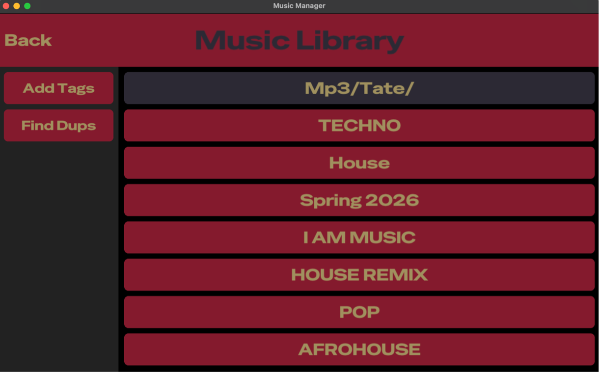

# Music Manager



Music Manager is a lightweight, interactive MP3 file manager with a GUI frontend built using **Raylib** and **Clay UI**.  

It is designed to help DJs organize their music collection and prepare libraries for **Serato** smart crates and **Rekordbox** intelligent playlists.  

This has only been tested on an ARM mac but should in theory work on Linux as well (let me know).

#### **Note: This program edits the metadata of ID3v2.3 and ID3v2.4 mp3 files and will overwrite any current comments in your mp3 files.**
---

## Features

- **Scan and display MP3 files**  
  Opens a directory called `mp3` (can be changed in the code) on the user's desktop, scans for all MP3 files contained within, and displays them in an interactive frontend.

- **Add Tags**  
  A button labeled **"Add Tags"** automatically adds a comment to each MP3 file containing the file path relative to the root `mp3` directory.  
  This is compatible with Serato smart crates for automatic sorting.

- **Find Duplicates**  
  A button labeled **"Find Dups"** uses djb2 hashing to find all duplicate songs and their locations in the root `mp3` directory.  

- **Planned Features**  
  - Edit metadata such as **title** and **artist**.
  - Remove metadata added by Serato to prepare files for re-analysis.
  - Support for mutiple alphabets.
  - Some way to mark remixes of songs.

- **Issues**  
  - Could be more performant.
  - Needs to use more const variables.
  - Would like to have getters and setters for all structs.
  - Want to move all button interaction into a function and have on hover interaction.
  - Would like to update the ID3v2.3 and ID3v2.4 editing files to use C++ and polymorphism.

---

## Installation

1. Clone the repository:

```bash
cd Desktop
git clone https://github.com/tateanders/Music-Manager.git
cd Music-Manager
```

2. Build the executable:

```bash
mkdir build
cd build
cmake ..
make
```

3. Run:

```bash
./Music-Manager
```

#### **Note: The Excecutable file can me placed on the desktop for more convenient access. The excecutable has no dependencies so the code can be deleted after compilation.**

4. Decompile:

```bash
cmake clean-all
```

---
acknowledgements:
  - name: Clay UI  
    url: https://github.com/nicbarker/clay.git 
    reason: "Lightweight and flexible UI components"
  - name: Raylib  
    url: https://github.com/raysan5/raylib.git
    reason: "Providing a simple and powerful graphics library to build the GUI frontend"
---